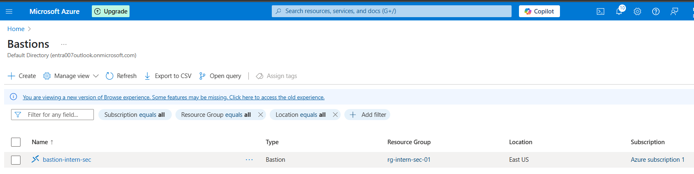

# Azure Secure Environment & Microsoft Defender for Cloud


---

## Overview

Built a secure Azure environment focused on network segmentation, secure administrative access, and continuous security monitoring using Microsoft Defender for Cloud.

The project simulates common infrastructure misconfigurations and validates how Microsoft Defender for Cloud detects and reports security risks.

---

## Environment Details

| Component | Configuration |
|---|---|
| Resource Group | `rg-intern-sec-01` |
| Virtual Network | `vnet-intern-sec-01` |
| Subnets | `web`, `db`, `mgmt` |
| Virtual Machine | `vm-sec-mgmt01` |
| Operating System | Windows Server 2019 |
| VM Size | Standard B1s |
| Secure Access | Azure Bastion |
| Monitoring | Defender for Cloud Plan 2 |

---

## Security Controls Implemented

- Network segmentation using dedicated subnets
- Bastion-only administrative access
- Removal of public IP exposure
- NSG-based traffic filtering
- Defender for Cloud security posture monitoring
- Microsoft Defender for Endpoint (MDE) auto-provisioning

---

## Simulated Security Scenarios

| Scenario | Defender Response |
|---|---|
| RDP exposed to the internet | Security recommendation and alert generated |
| Windows Updates disabled | Missing patch recommendation detected |

---

## Infrastructure as Code

The project includes Azure Bicep templates and PowerShell deployment automation.

### Deployment Files

```txt
bicep/
├── main.bicep
└── parameters.json

scripts/
└── deploy.ps1
```

### Automated Resources

- Resource Group
- Virtual Network
- Subnets
- NSGs
- Virtual Machine
- Azure Bastion

---

## Screenshots

The `images/` folder includes:

- Azure Bastion access
- NSG configuration
- Defender for Cloud recommendations
- Security alerts and findings

### Azure Bastion Access



---

### NSG Misconfiguration Simulation


---

### Defender for Cloud Recommendation


---

### Missing Updates Detection


---

## Documentation

Additional project documentation:

- `docs/implementation-guide.md`
- `docs/findings-and-remediation.md`
- `docs/troubleshooting.md`
- `docs/lessons-learned.md`

---

## Security Benefits Demonstrated

- Reduced external attack surface
- Secure administrative access through Azure Bastion
- Improved visibility into infrastructure security posture
- Continuous monitoring of cloud configuration risks
- Detection and remediation of insecure configurations

---

## Key Takeaways

- Network segmentation improves workload isolation
- Removing direct RDP exposure significantly reduces risk
- Defender for Cloud provides valuable posture visibility
- NSG configuration plays a critical role in Azure security
- Infrastructure monitoring should be continuous and proactive

---

## Status

Completed — continuously expanding with additional security monitoring and hardening scenarios.
