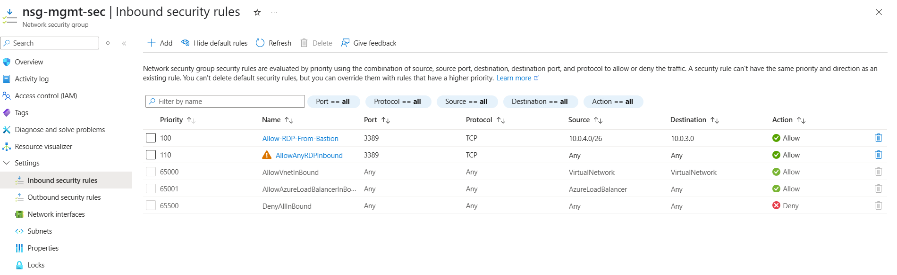
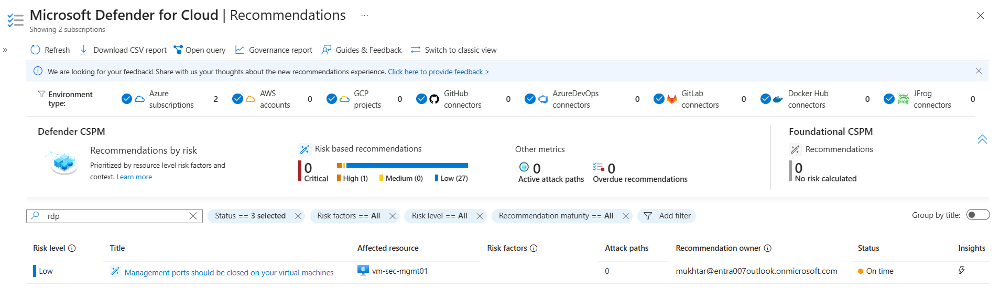
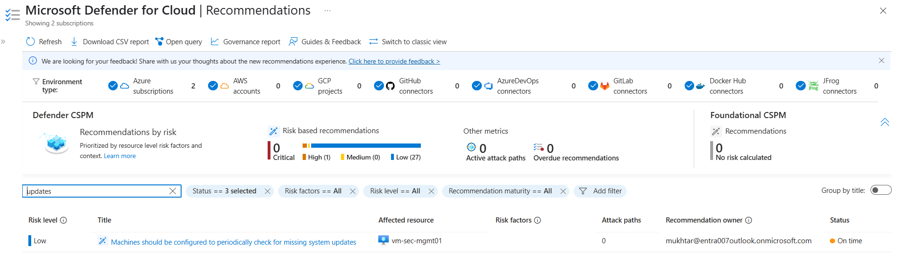

# Secure Azure Environment — Security Findings & Remediation Report


---

## Overview

This report documents the security controls implemented in the Azure environment, the simulated security scenarios performed, and the findings detected by Microsoft Defender for Cloud.

The objective was to validate how Microsoft Defender for Cloud identifies insecure configurations and provides actionable remediation guidance.

---

## Environment Summary

| Component | Configuration |
|---|---|
| Resource Group | `rg-intern-sec-01` |
| Virtual Network | `vnet-intern-sec-01` |
| Subnets | `web-subnet`, `db-subnet`, `mgmt-subnet` |
| Virtual Machine | `vm-sec-mgmt01` |
| Operating System | Windows Server 2019 |
| Secure Access | Azure Bastion |
| Monitoring | Defender for Cloud Plan 2 |

---

## Security Controls Implemented

### Network Segmentation

Configured a segmented Azure Virtual Network with dedicated subnets for workload separation.

| Subnet | Address Space |
|---|---|
| `web-subnet` | `10.0.1.0/24` |
| `db-subnet` | `10.0.2.0/24` |
| `mgmt-subnet` | `10.0.3.0/24` |

### NSG-Based Hardening

Implemented Network Security Group (NSG) rules to restrict management access.

### Security Configuration

- RDP access allowed only through Azure Bastion
- Public inbound management access blocked
- Management VM isolated inside dedicated subnet

### Azure Bastion Deployment

Azure Bastion was deployed to provide secure browser-based administrative access without assigning a public IP address to the VM.

### Microsoft Defender for Cloud

Enabled Microsoft Defender for Servers Plan 2 and verified automatic onboarding of monitoring agents.

### Features Enabled

- Defender for Cloud recommendations
- Security posture monitoring
- Microsoft Defender for Endpoint (MDE) onboarding
- Continuous assessment of VM security configuration

---

## Simulated Security Scenarios

Intentional misconfigurations were introduced to validate Defender for Cloud detection capabilities.

### Scenario 1 — RDP Exposure to Internet

### Actions Performed

- Modified NSG rules to expose RDP (TCP 3389) publicly
- Simulated insecure administrative access configuration

### Defender Response

- Defender for Cloud detected exposed management ports
- High-priority recommendation generated
- Risk surfaced under security recommendations

### Validation





---

## Scenario 2 — Missing System Updates

### Actions Performed

- Disabled Windows Update service temporarily
- Simulated unpatched VM condition

### Defender Response

- VM flagged as missing important updates
- Secure posture recommendation generated

### Validation



---

## Findings Summary

| Finding | Description | Status |
|---|---|---|
| NSG Misconfiguration | RDP exposed to the internet | Resolved |
| Missing System Updates | Automatic updates disabled | Resolved |

---

## Remediation Actions

### RDP Exposure Remediation

- Removed public RDP access
- Reapplied secure NSG rules
- Restricted management access to Azure Bastion only

### Missing Updates Remediation

- Re-enabled Windows Update service
- Allowed system updates to install
- Verified Defender recommendation clearance

Both findings were successfully remediated and removed from Defender for Cloud recommendations after configuration correction.

---

## Security Benefits Demonstrated

- Reduced attack surface through Bastion-only access
- Improved workload isolation using subnet segmentation
- Continuous security posture assessment
- Detection of insecure cloud configurations
- Visibility into infrastructure security risks

---

## Key Takeaways

- Exposed management ports remain a major cloud security risk
- Defender for Cloud provides effective posture monitoring
- Network segmentation improves infrastructure security
- Continuous monitoring is important for maintaining secure configurations
- Small configuration changes can introduce significant exposure

---

## Supporting Evidence

Additional screenshots and implementation details are available in:

```txt
images/
docs/
```

---

## Status

Completed — security scenarios validated successfully and remediation confirmed.
